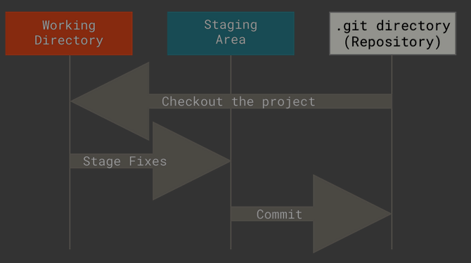

<style>
section {
  font-size: 24px;
  padding: 30px 40px;
  background: #ffffff;
  color: #1a1a2e;
  position: relative;
  background-image: url('./docs/Team_signal.png');
  background-repeat: no-repeat;
  background-position: top 15px right 20px;
  background-size: 90px;
}
section:first-of-type {
  display: flex;
  flex-direction: column;
  justify-content: center;
  text-align: center;
}
section:first-of-type h1 {
  border-bottom: none;
  font-size: 2.2em;
}
section::after {
  color: #2b5b84;
  font-size: 0.6em;
}
h1 {
  color: #2b5b84;
  font-size: 1.6em;
  border-bottom: 2px solid #e65100;
  padding-bottom: 0.15em;
  margin: 0 0 0.3em 0;
}
h2 {
  color: #2b5b84;
  font-size: 1.3em;
  margin: 0 0 0.3em 0;
}
h3 {
  color: #2b5b84;
  font-size: 1.1em;
  margin: 0 0 0.3em 0;
}
strong {
  color: #e65100;
}
code {
  background: #282c34;
  color: #e5c07b;
  padding: 0.1em 0.3em;
  border-radius: 4px;
  font-size: 0.75em;
}
pre {
  background: #282c34;
  border-radius: 6px;
  padding: 0.5em 0.9em;
  font-size: 0.55em;
  line-height: 1.35;
  border: 1px solid #3e4451;
  margin: 0.3em 0;
}
pre code {
  background: transparent;
  padding: 0;
  color: #abb2bf;
}
blockquote {
  border-left: 3px solid #e65100;
  padding-left: 0.8em;
  color: #555;
  font-style: italic;
  margin: 0.4em 0;
}
table {
  width: 100%;
  border-collapse: collapse;
  font-size: 0.75em;
  margin: 0.4em 0;
}
th {
  background: #2b5b84;
  color: #fff;
  padding: 6px 10px;
  text-align: left;
}
td {
  padding: 4px 10px;
  border-bottom: 1px solid #ddd;
}
tr:nth-child(even) {
  background: #eef2f7;
}
ul, ol {
  line-height: 1.5;
  margin: 0.3em 0;
  padding-left: 1.5em;
}
li {
  margin: 0.1em 0;
}
a {
  color: #e65100;
  text-decoration: none;
}
a:hover {
  text-decoration: underline;
}
img {
  max-width: 80%;
  height: auto;
  display: block;
  margin: 0 auto;
  border-radius: 8px;
  box-shadow: 0 3px 8px rgba(0,0,0,0.1);
}
p {
  margin: 0.3em 0;
}
</style>

# git：版本控制入门
- 分布式版本控制系统
- **安装**：
```bash
sudo apt install git
# 检验版本
git --version # 看到版本号即可
```
- 配置
    #### 全局配置
    - git config --global user.name "Your Name"
    - git config --global user.email "your@email.com"

    #### 仅当前仓库配置
    - git config user.name "Project Name"
    - git config user.email "project@email.com"


---

## 工作流程概览


---

### 基础命令概览

| 命令 | 作用 |
|------|------|
| `git init` | 初始化仓库 |
| `git status` | 查看状态 |
| `git add` | 添加至暂存区 |
| `git commit` | 提交至本地仓库 |
| `git push` | 推送至远程仓库 |
| `git pull` | 拉取远程更新 |
| `git branch` | 分支管理 |
| `git checkout` | 切换分支 |
| `git log` | 查看提交历史 |

---

# git init — 初始化仓库

```bash
# 在当前目录创建新仓库
git init
```

- 生成 `.git` 隐藏目录（仓库核心）
- 只需执行一次
- 执行后目录变为**工作区**

---

# .gitignore — 忽略不需要的文件

创建 `.gitignore` 文件，写入不需要 Git 跟踪的内容：

```bash
# 临时文件
*.log
*.tmp
```

> `git init` 后**第一时间**创建 `.gitignore` 是好习惯

---

# git status — 查看状态

```bash
# 查看当前仓库状态
git status

# 精简输出
git status -s
```

**常见状态符号**（`-s` 模式）：
- `??` — 未跟踪的新文件
- `M` — 已修改
- `A` — 已暂存

养成**常看 status** 的好习惯！

---

# git add — 添加到暂存区

```bash
# 添加单个文件
git add sample.cpp

# 添加所有改动的文件
git add .
```

> 暂存区（Stage/Index）是提交前的"预览区"
>
>  `git add .` 会添加**所有**改动，建议先用 `git status` 确认范围

---

# git commit — 提交到本地仓库

```bash
# 提交并编辑提交信息
git commit

# 直接附带提交信息
git commit -m "feat: 添加用户登录功能"
```

**提交信息规范**：
- `feat:` 新功能
- `fix:` 修复
- `docs:` 文档
- `refactor:` 重构

---

# git branch — 分支管理

```bash
# 查看本地分支（* 表示当前分支）
git branch

# 创建新分支
git branch feature-login

# 删除分支
git branch -d feature-login

# 查看所有分支（含远程）
git branch -a
```

---

# git checkout — 切换分支/恢复文件

```bash
# 切换分支
git checkout feature-login

# 创建并切换（一步到位）
git checkout -b feature-login

# 恢复工作区文件
git checkout -- index.html
```

> 较新版本中，`git checkout` 的职责被拆分为 `git switch`（切换分支）和 `git restore`（恢复文件），分工更清晰

---

# git log — 查看提交历史

```bash
# 完整日志
git log

# 单行简洁模式
git log --oneline

# 图形化显示分支
git log --graph --oneline --all

# 指定数量
git log -5
```

---

# git push — 推送至远程仓库

```bash
# 推送至远程（首次需指定分支）
git push origin main

# 设置上游并推送
git push -u origin main

# 之后可简写
git push
```

> 首次推送需关联远程仓库：`git remote add origin <仓库地址>`

---

# git pull — 拉取远程更新

```bash
# 拉取并合并
git pull

# 拉取但不自动合并（fetch + merge 分开）
git fetch
git merge origin/main
```

> `git pull = git fetch + git merge`

---

# 连接远程仓库

**方式一：HTTPS**
```bash
git remote add origin https://github.com/用户名/仓库名.git
# 首次推送输入 GitHub 用户名和密码（或个人访问令牌）
git push -u origin main
```

**方式二：SSH（免密）**
```bash
# 1. 生成 SSH 密钥（一路回车）
ssh-keygen -t ed25519 -C "your@email.com"

# 2. 查看公钥并复制
cat ~/.ssh/id_ed25519.pub

# 3. 粘贴到 GitHub → Settings → SSH and GPG keys

# 4. 添加远程仓库
git remote add origin git@github.com:用户名/仓库名.git

# 5. 推送（无需密码）
git push -u origin main
```

---

## 远程仓库管理

```bash
# 查看已配置的远程仓库
git remote -v

# 删除远程仓库
git remote remove origin

# 修改远程仓库地址
git remote set-url origin <新地址>
```

> 💡 **提示**：HTTPS 需使用**个人访问令牌**（token）代替密码，
> 在 GitHub → Settings → Developer settings → Personal access tokens 生成

---

# VS Code 中使用 Git

VS Code 内置了完整的 Git 可视化支持 

---

## VS Code Git 界面

| 区域 | 快捷键 | 功能 |
|------|--------|------|
| **源代码管理** | `Ctrl+Shift+G` | 面板入口 |
| 更改 | — | 查看未暂存的修改 |
| 暂存的更改 | — | 查看已暂存的修改 |
| 输入框 | — | 写提交信息 |
| ✓ 按钮 | `Ctrl+Enter` | 提交 |
| `...` 菜单 | — | push / pull / 分支管理等 |

---

## VS Code — 常用 Git 操作

**查看文件变更：**
- 文件列表中的 `M` / `U` / `D` 标记
- 编辑器中红色/绿色条表示修改
- 点击文件可直接查看 **diff**

**可视化操作：**
- 点击 `+` 暂存文件
- 点击撤销箭头放弃更改
- `...` → 拉取/推送/同步
- 左下角分支名 → 快速切换分支

---

## VS Code — 图形化功能

**图形化提交历史：**
- Git History 扩展或内建视图
- 浏览分支、标签、提交
- 右键 cherry-pick / revert

**冲突解决：**
- VS Code 提供三路合并编辑器
- Accept Current / Incoming / Both 按钮
- 可视化对比，消除冲突

> 推荐扩展：GitLens — 增强版 Git 体验

---

# 常用工作流示例

```bash
# 1. 初始化
git init
git remote add origin <url>

# 2. 开发新功能
git checkout -b feature-xxx

# 3. 修改代码 → 提交
git add .
git commit -m "feat: xxx"

# 4. 推送并创建 PR
git push -u origin feature-xxx

# 5. 合并到主分支
git checkout main
git pull
git merge feature-xxx
git push
```

---

### 小结

| 步骤 | 命令 |
|------|------|
| 🏗️ 初始化 | `git init` |
| 📝 查看状态 | `git status` |
| ➕ 暂存 | `git add` |
| 💾 提交 | `git commit -m "消息"` |
| 🌿 分支 | `git branch` / `git checkout` |
| 📜 历史 | `git log --oneline --graph` |
| ☁️ 远程推送 | `git push` |
| ⬇️ 远程拉取 | `git pull` |

> **VS Code **：大部分操作可在 `Ctrl+Shift+G` 面板中可视化完成！
